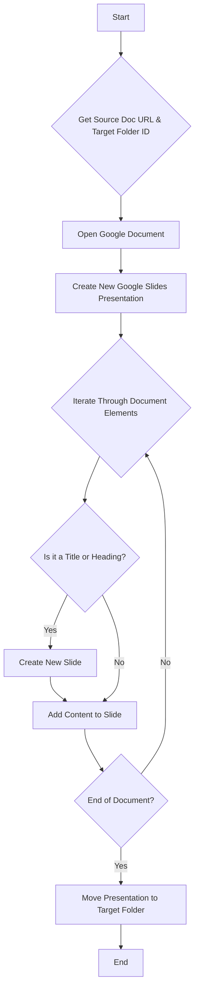

# Technical Documentation

This document provides a technical overview of the Google Document to Slide Generator project.

## 1. Introduction

The Google Document to Slide Generator is a Google Apps Script designed to automate the process of creating Google Slides presentations from Google Documents. The script reads a source Google Document, identifies structured content such as titles, headings, lists, and images, and then generates a new Google Slides presentation with corresponding slides and content.

This tool is particularly useful for users who frequently create presentations based on existing documents, saving time and effort by automating the conversion process.

## 2. Overview

The script operates within the Google Workspace environment and leverages the `DocumentApp` and `SlidesApp` services to interact with Google Docs and Google Slides. The core functionality includes:

- **Reading a Google Document:** The script takes the URL of a Google Document as input.
- **Creating a Google Slides Presentation:** It generates a new presentation with a name derived from the source document.
- **Parsing Document Content:** It iterates through the elements of the document, identifying different content types (e.g., paragraphs, lists, images).
- **Generating Slides:** It creates new slides for titles and headings and populates them with the corresponding content from the document.
- **Handling Various Content Types:** The script can process titles, subtitles, headings (H1, H2, H3), normal text, bulleted lists, and inline images.
- **Organizing Output:** The final presentation is automatically moved to a specified Google Drive folder.

## 3. Architecture and Logic

The script is designed to be a single, self-contained Google Apps Script file (`code.gs`). It follows a straightforward, procedural approach to converting a Google Document to a Google Slides presentation.

### 3.1. Workflow

The conversion process can be broken down into the following steps:

1.  **Initialization**: The `convert()` function is the main entry point. It sets up the necessary variables, including the URL of the source Google Document and the ID of the target Google Drive folder.

2.  **Document Access**: The script opens the Google Document using its URL and retrieves its ID.

3.  **Presentation Creation**: A new Google Slides presentation is created with the same name as the source document.

4.  **Content Parsing and Slide Generation**: The script iterates through each element of the Google Document's body. It identifies the type of each element (e.g., paragraph, list item, image) and its style (e.g., title, heading, normal text).
    - A new slide is created for each title and heading (H1, H2, H3).
    - The content of the paragraph (text or image) is added to the corresponding slide.
    - List items are formatted and appended to the current slide.

5.  **File Management**: Once the conversion is complete, the newly created presentation is moved to the specified target folder in Google Drive.

### 3.2. Visual Workflow

The following flowchart illustrates the high-level workflow of the script:

## 4. Function Reference

This section provides a detailed description of each function in the `code.gs` script.

### 4.1. `convert()`

-   **Description**: This is the main function that orchestrates the entire document-to-presentation conversion process. It initializes variables, calls helper functions to perform specific tasks, and logs the progress of the conversion.
-   **Parameters**: None.
-   **Returns**: Nothing.

### 4.2. `openDocument(url)`

-   **Description**: This function opens a Google Document using the provided URL and returns its unique ID.
-   **Parameters**:
    -   `url` (String): The URL of the Google Document to be opened.
-   **Returns**: (String) The ID of the Google Document.

### 4.3. `createPresentation(presName)`

-   **Description**: This function creates a new Google Slides presentation with the specified name.
-   **Parameters**:
    -   `presName` (String): The name for the new presentation.
-   **Returns**: (String) The ID of the newly created presentation.

### 4.4. `createSlide(presId, docId)`

-   **Description**: This is the core function responsible for parsing the content of the Google Document and generating the slides. It iterates through the document's elements, identifies their types and styles, and adds them to the presentation.
-   **Parameters**:
    -   `presId` (String): The ID of the Google Slides presentation.
    -   `docId` (String): The ID of the Google Document.
-   **Returns**: Nothing.

## 5. Conclusion

This technical documentation provides a comprehensive overview of the Google Document to Slide Generator script. It covers the project's purpose, architecture, and the implementation details of its core functions. This document should serve as a useful resource for understanding, maintaining, and extending the script's functionality.
